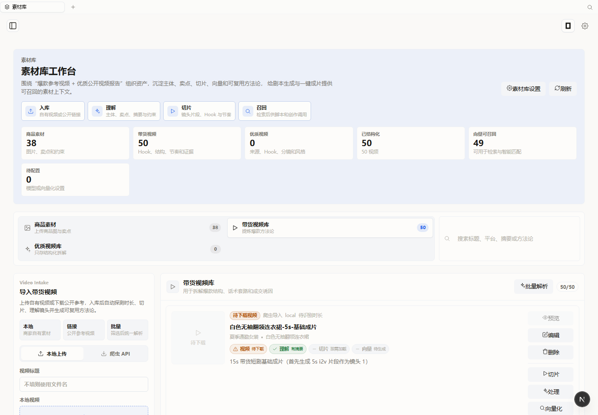
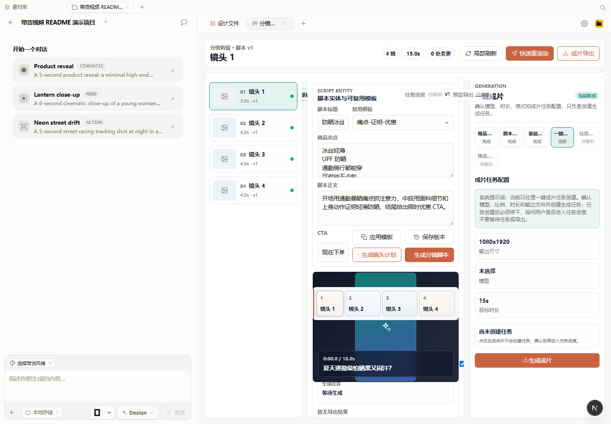
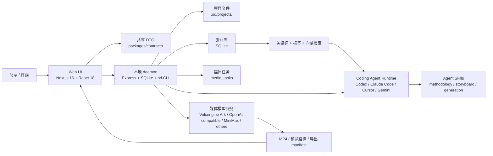

# 电商场景 AIGC 带货视频生成系统

面向跨境电商和短视频带货场景的 AIGC 视频生产工作台。项目基于 Open Design 扩展，目标是把“商品素材 -> 爆款方法论 -> 剧本分镜 -> 一键成片 -> 任务进度 -> 预览导出 -> 转化复盘”做成可交互、可复核、可被 Agent 调用的全栈闭环。

> 当前状态：可用本地 Demo + 可复核源码分支。视频实际生成依赖媒体模型密钥、额度和网络环境；请勿把任何 API Key 写入仓库、截图或演示视频。

## 项目信息

| 字段 | 内容 |
|---|---|
| 项目名称 | 电商场景 AIGC 带货视频生成系统 |
| 项目简称 | Commerce Video Workbench / 带货视频工作台 |
| 参赛课题 | 电商场景 AIGC 带货视频生成系统 |
| 一句话价值 | 让商家从商品素材出发，端到端生成 15 秒内带货短视频，并通过分镜干预、素材检索和转化看板持续优化内容生产。 |
| 源码分支 | `codex/ecommerce-video-workbench` |
| 评审材料 | [项目提交评审材料.md](项目提交评审材料.md) |
| Agent skill 包 | [skills/commerce-video-methodology-extractor/SKILL.md](skills/commerce-video-methodology-extractor/SKILL.md) |

## 为什么做

电商商家想做短视频带货时，常见问题不是“缺一个文生视频按钮”，而是整条生产链都不稳定：

- 商品素材散落在图片、视频、链接和参考案例里，难以复用。
- 通用视频模型容易生成“好看但不准”的画面，商品卖点和真实外观不可控。
- 剧本、分镜、素材切片、口播、CTA 缺少统一结构，团队很难协作修改。
- 生成后没有把视频策略与转化效果连起来，下一轮创作仍然靠经验。

本项目把视频生产拆成可验证阶段：先沉淀素材，再生成脚本和分镜，随后创建成片任务，最后用数据看板复盘生成因子和转化效果。

## 核心功能

1. **素材库建设**  
   支持商品图片、商品视频、参考视频和公开搜索结果入库；后端记录来源、类目、摘要、标签、文件和处理状态。

2. **多颗粒度素材理解**  
   对带货视频进行整体理解、切片、slice 特征抽取和 Embedding 配置，形成商品、视频、slice 三层可检索资产。

3. **检索与方法论提炼**  
   支持关键词、标签、向量相似度混合召回；`commerce-video-methodology-extractor` skill 可将同结构参考视频提炼为中文创作方法论。

4. **剧本与分镜编辑器**  
   `StoryboardEditor` 提供脚本模板、卖点编辑、分镜列表、素材切片绑定、时长调整、台词改写、单镜重生成提示词。

5. **严格分阶段一键成片**  
   workflow 拆成商品素材、剧本生成、基础分镜、一键成片、任务进度、预览导出六个阶段，避免 Agent 一次性越权跑完整链路。

6. **成片与转化诊断看板**  
   `VideoDashboardView` 展示已完成视频、曝光、完播、加购、转化率、ROAS、生成因子热力图和下一轮生成建议。

## 功能截图与使用说明

### 1. 综合工作台：统一入口


**使用路径：** 启动本地服务后打开 `http://127.0.0.1:17573`。  
**功能说明：** 首页把视频抓取、素材库分析、脚本分镜、视频生成和生成诊断集中到一个工作台。评委可以从最近项目进入已创建的带货视频项目，也可以直接在输入框里输入商品、关键词、素材或公开视频链接，让 Agent 按任务类型进入对应流程。

### 2. 素材库工作台：入库、理解、切片、召回



**使用路径：** 左侧导航点击“素材库”，或访问 `/asset-library`。  
**功能说明：** 素材库围绕“爆款参考视频 + 优质公开视频报告”组织资产，提供入库、理解、切片、召回四步链路。页面上方展示商品素材、带货视频、已结构化视频、向量可召回数量；下方可导入本地视频、公开视频链接或批量处理素材。后端会沉淀视频摘要、Hook、节奏、切片特征和 Embedding，为脚本生成和分镜创作提供可召回上下文。

### 3. 分镜剪辑：脚本、镜头、成片任务分阶段推进



**使用路径：** 打开任意项目 Studio，点击标签栏 `+`，选择“分镜剪辑”；也可通过项目深链进入 `storyboard:editor` 标签。  
**功能说明：** 分镜工作台把带货视频创作拆成六个阶段：商品素材、剧本生成、基础分镜、一键成片、任务进度、预览导出。中间区域编辑脚本标题、复用模板、卖点、CTA 和镜头列表；每个镜头可独立调整画面目标、时长、素材切片和台词。右侧阶段栏显示当前进度，并把“一键成片”和“任务进度”拆开，避免模型长任务阻塞 UI 或 Agent 越权直接跑完整链路。

### 4. 数据看板：生成因子与转化诊断


**使用路径：** 左侧导航点击“数据看板”，或访问 `/video-dashboard`。  
**功能说明：** 数据看板展示已完成视频、曝光、平均转化率、完播率、ROAS 和最佳视频。下方以视频卡片、生成因子热力图、因子命中分布和下一轮建议，把脚本策略、素材因子和转化结果放在同一张分析视图里。当前为可解释样例数据，展示后续接入真实投放数据后的增长复盘形态。

## 系统架构



## 技术栈

| 层级 | 技术 | 说明 |
|---|---|---|
| 前端 | Next.js 16、React 18、TypeScript、CSS Modules、`@open-design/components` | 首页导航、素材库、分镜工作台、数据看板、项目 Studio |
| 后端 | Node.js 24、Express、TypeScript | REST API、SSE、Agent 调度、项目文件和静态资源服务 |
| 数据 | SQLite、`better-sqlite3` | 项目、素材、slice、处理任务、媒体任务持久化 |
| CLI | `od` | Web UI 与外部 Agent 共用同一套能力 |
| AI / 媒体 | Volcengine Ark、OpenAI-compatible provider、MiniMax 等 | 视频生成、视频理解、图片生成、TTS、Embedding |
| Agent | Codex、Claude Code、Cursor Agent、Gemini CLI 等 | 读取素材库上下文和 `SKILL.md`，按阶段生成脚本、分镜和提示词 |

## 关键目录

| 路径 | 作用 |
|---|---|
| `apps/web/src/components/StoryboardEditor.tsx` | 带货视频脚本、分镜、生成、进度、导出工作台 |
| `apps/web/src/components/VideoDashboardView.tsx` | 成果视频与转化诊断看板 |
| `apps/web/src/providers/commerce-video.ts` | 前端 commerce-video API provider |
| `apps/daemon/src/routes/commerce-video.ts` | 后端六阶段 workflow API |
| `apps/daemon/src/commerce-video-cli.ts` | `od commerce-video ...` CLI |
| `apps/daemon/src/routes/asset-library.ts` | 商品素材、带货视频、切片、Embedding、方法论 summary |
| `apps/daemon/src/asset-library-search.ts` | 素材库关键词、标签、向量混合检索 |
| `packages/contracts/src/api/commerce-video.ts` | Web / daemon / CLI 共享 DTO |
| `skills/commerce-video-methodology-extractor/SKILL.md` | 带货视频方法论提炼 skill |
| `项目提交评审材料.md` | 完赛提交材料草稿 |

## 本地运行

### 环境要求

- Node.js `~24`
- pnpm `10.33.2`
- 推荐 macOS、Linux、WSL2；Windows native 为 best-effort
- 可选：Codex / Claude Code / Cursor Agent / Gemini CLI 等本地 Agent CLI
- 可选：媒体模型 provider 密钥，用于真实视频生成、视频理解和 Embedding

### 启动

```bash
pnpm install
pnpm tools-dev run web --daemon-port 17456 --web-port 17573
```

打开：

```text
http://127.0.0.1:17573
```

健康检查：

```text
http://127.0.0.1:17456/api/health
```

## 配置模型能力

进入 Web 端 Settings -> Media providers，配置需要的媒体 provider。也可以使用环境变量，例如：

```bash
OD_VOLCENGINE_API_KEY=<your-key>
OD_VOLCENGINE_ARK_API_KEY=<your-key>
OPENAI_API_KEY=<your-key>
```

注意：

- README、评审文档、截图、录屏和 Git 提交中都不要出现真实密钥。
- 如果未配置视频生成 provider，仍可展示素材库、脚本、分镜、workflow、CLI、数据看板等工程闭环。

## Web 端体验路径

1. 启动本地服务后进入 `http://127.0.0.1:17573`。
2. 点击左侧导航“素材库”，上传商品素材或导入参考视频。
3. 创建或打开一个项目，进入项目 Studio。
4. 点击标签栏 `+`，选择“分镜剪辑”，打开带货视频工作台。
5. 在“商品素材”阶段确认素材。
6. 在“剧本生成”阶段选择脚本模板或让 Agent 生成 Hook、卖点、口播和 CTA。
7. 在“基础分镜”阶段编辑镜头、素材切片、时长、台词和 QA 检查点。
8. 在“一键成片”阶段创建生成任务。
9. 在“任务进度”阶段等待任务，查看进度和错误。
10. 在“预览导出”阶段读取预览路径和导出 manifest。
11. 返回首页左侧“数据看板”，查看生成因子与转化诊断。

## CLI 体验路径

`od commerce-video` 是 Web UI 的同构 CLI 入口，适合评委复核和外部 Agent 调用。

```bash
od commerce-video workflow --project <project-id> --json
od commerce-video materials --project <project-id> --materials-json '{"productAssetIds":[],"uploadedFiles":[]}' --json
od commerce-video script --project <project-id> --title "便携榨汁杯 15 秒带货脚本" --hook "通勤早餐来不及？" --prompt-file script.txt --json
od commerce-video storyboard --project <project-id> --storyboard-json storyboard.json --json
od commerce-video generate --project <project-id> --model doubao-seedance-2-0-260128 --length-sec 15 --aspect 9:16 --json
od commerce-video jobs --project <project-id> --json
od commerce-video wait <job-id> --json
od commerce-video preview --project <project-id> --json
od commerce-video export --project <project-id> --json
```

默认推荐严格分阶段执行。如果确实要无人值守等待生成任务，可显式使用：

```bash
od commerce-video generate --project <project-id> --model doubao-seedance-2-0-260128 --follow --full-auto --json
```

素材库 CLI 示例：

```bash
od assets status --json
od assets commerce-videos search --connector bilibili --query "女装 带货 防晒衣" --limit 20 --sort hot --json
od assets commerce-videos import --title "<title>" --connector bilibili --source-url "<url>" --subject "防晒衣" --category "带货视频样本" --summary "<why selected>" --json
od assets commerce-videos process <asset-id> --wait --json
od assets commerce-videos slice <asset-id> --wait --json
od assets commerce-videos embed <asset-id> --include-slices --wait --json
od assets commerce-videos methodology-summary --query "防晒衣 痛点钩子" --json
```

## API 摘要

| 方法 | 路径 | 作用 |
|---|---|---|
| `GET` | `/api/projects/:id/commerce-video/workflow` | 读取或初始化项目级 workflow |
| `POST` | `/api/projects/:id/commerce-video/materials` | 保存素材阶段 |
| `POST` | `/api/projects/:id/commerce-video/script` | 保存剧本阶段 |
| `POST` | `/api/projects/:id/commerce-video/storyboard` | 保存分镜阶段 |
| `POST` | `/api/projects/:id/commerce-video/generate` | 创建视频生成任务 |
| `GET` | `/api/projects/:id/commerce-video/jobs` | 查看生成任务 |
| `POST` | `/api/commerce-video/jobs/:jobId/wait` | 等待任务进度 |
| `GET` | `/api/projects/:id/commerce-video/preview` | 读取预览状态 |
| `POST` | `/api/projects/:id/commerce-video/export` | 写入导出 manifest |

项目 workflow 文件保存在：

```text
.od/projects/<project-id>/commerce-video.workflow.json
```

## 测试与验证

建议提交前运行：

```bash
pnpm guard
pnpm typecheck
pnpm --filter @open-design/web test
pnpm --filter @open-design/daemon test
pnpm --filter @open-design/contracts test
```

重点测试文件：

| 文件 | 覆盖内容 |
|---|---|
| `packages/contracts/tests/commerce-video.test.ts` | workflow DTO 与六阶段顺序 |
| `apps/daemon/tests/commerce-video-workflow-routes.test.ts` | 后端 workflow、任务等待、预览导出 |
| `apps/daemon/tests/commerce-video-cli.test.ts` | CLI JSON 输出与 prompt 文件 |
| `apps/web/tests/components/StoryboardEditor.test.tsx` | 分镜编辑器、阶段门禁、生成/进度/导出拆分 |
| `apps/web/tests/components/AssetLibraryView.test.tsx` | 素材库上传、StrictMode 去重、不预加载源视频 |
| `apps/daemon/tests/asset-library-search.test.ts` | 素材库混合检索排序 |

## 已知限制

- 在线 Demo、演示视频链接和团队信息需要在最终提交前补齐。
- 真实视频生成依赖 provider 密钥、额度和网络环境；没有密钥时可用 workflow 和 Mock/示例数据展示工程链路。
- 转化诊断看板当前使用可解释的样例数据，适合展示“生成因子 x 转化效果”的产品方向；接入真实投放数据是下一阶段工作。
- 部分公开平台视频抓取受平台规则、版权和网络环境约束，评审演示建议使用自有素材或公开视频的结构化分析结果。

## Demo 录制节奏

推荐录制 5-6 分钟，核心原则是“先讲价值，再跑链路，最后证明工程深度”。不要一开始就解释代码目录，评委通常需要先看到业务问题和可用成果。

| 时间 | 画面 | 讲什么 |
|---|---|---|
| 0:00-0:25 | 标题页 / 首页 | 一句话说明：这是面向商家的 AIGC 带货视频生成系统，从商品素材到 15 秒成片再到转化复盘。 |
| 0:25-0:55 | 首页 + 左侧导航 | 快速点出四个核心入口：素材库、项目 Studio、分镜剪辑、数据看板。 |
| 0:55-1:35 | 素材库 | 展示商品图、商品视频、参考视频入库；说明系统保存来源、标签、理解结果、slice 和 Embedding，用于后续召回。 |
| 1:35-2:30 | 项目 Studio -> 分镜剪辑 | 打开 `+` 菜单选择“分镜剪辑”，展示六阶段工作流：商品素材、剧本生成、基础分镜、一键成片、任务进度、预览导出。 |
| 2:30-3:20 | 剧本与分镜编辑 | 展示脚本模板、Hook、卖点、CTA；修改一个分镜的画面目标、时长、素材切片和台词，强调“不是黑盒一次生成”。 |
| 3:20-4:05 | 一键成片 + 任务进度 | 选择模型、9:16、15 秒，创建任务；展示 taskId、进度、错误兜底和 wait 阶段。如果真实生成耗时较长，可切到已完成样例。 |
| 4:05-4:35 | 预览导出 | 展示预览路径、导出路径或 manifest；说明输出可复核，项目文件在 `.od/projects/<id>/` 下。 |
| 4:35-5:15 | 数据看板 | 展示已完成视频、转化率、ROAS、生成因子热力图和下一轮建议，收束到“生成 -> 复盘 -> 再生成”的业务闭环。 |
| 5:15-5:50 | 技术收尾 | 快速展示 README、API/CLI、测试文件；说明 Web UI 和 `od commerce-video` CLI 调用同一套后端能力。 |

录制时建议准备两个项目：一个空项目展示从 0 到 1 的流程，一个预置完成项目展示成片、导出和数据看板，避免现场等待视频模型生成拖慢节奏。

## 安全说明

- 不提交 API Key、Endpoint 私密配置、账号密码、Cookie 或内部额度截图。
- 不复刻或混剪未授权公开视频；素材库只保存公开来源的结构化分析、摘要、标签和方法论证据。
- 真实商用前需要补充版权审核、平台规则检查、商品功效合规和广告法风险提示。
