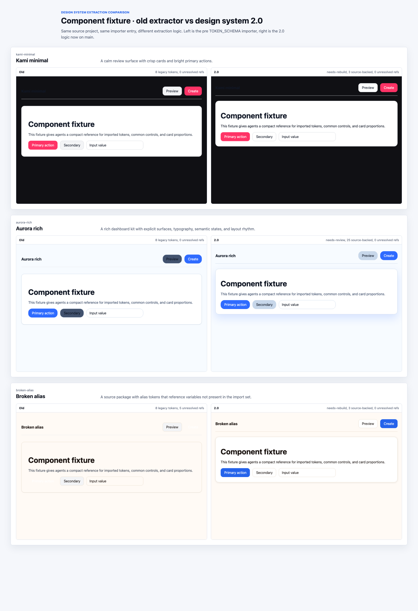
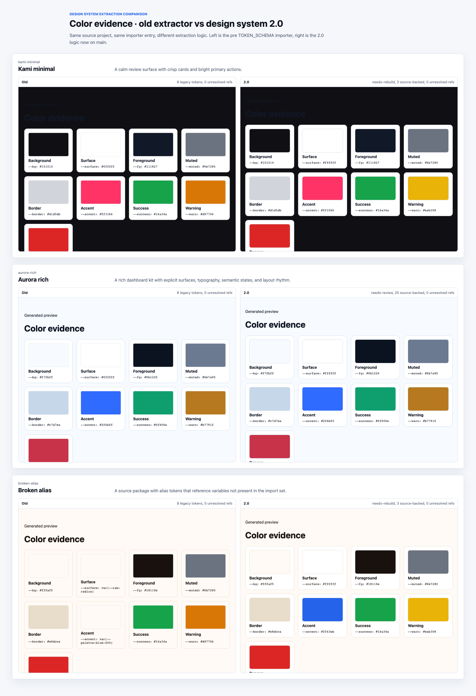
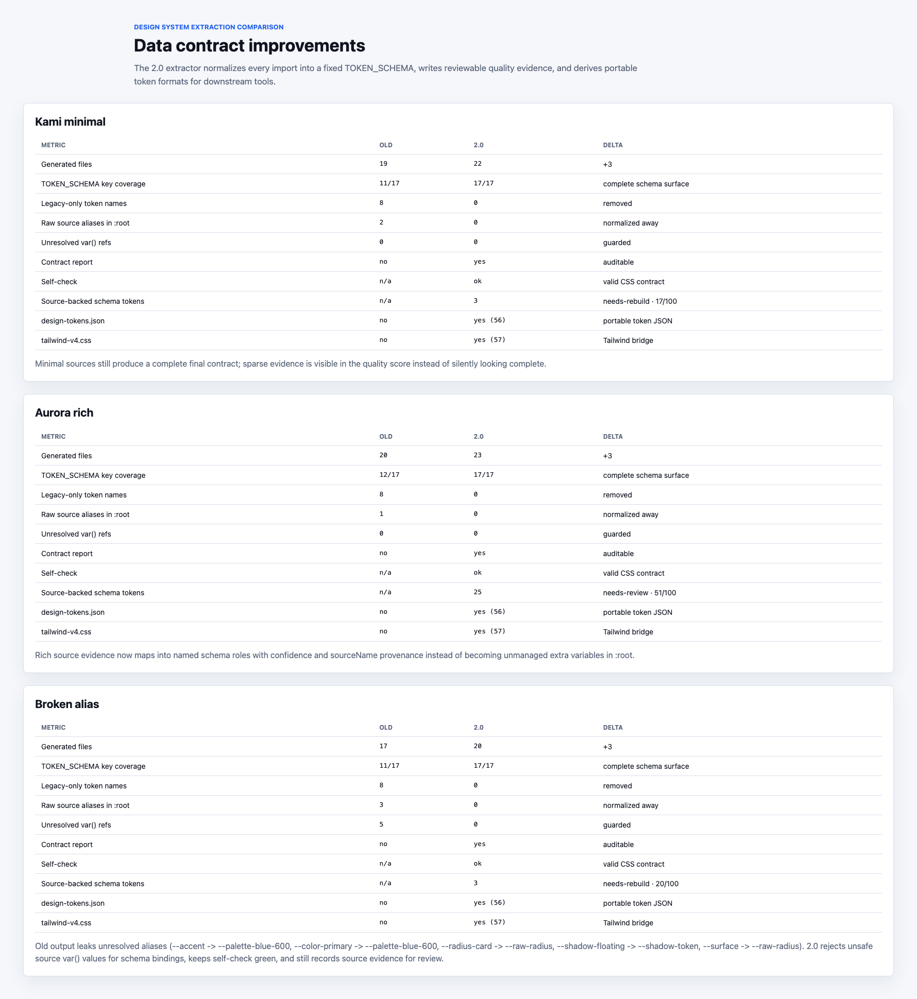

# Design System 2.0 Backfill Plan

## Summary

Open Design now has two related but different design-system states:

1. The bundled catalog already has Design System 1.0 structured fixtures: all
   150 bundled systems ship `tokens.css` and `components.html`, and the guard
   confirms those files satisfy the shared token schema.
2. New user imports now use the Design System 2.0 importer: local, GitHub, and
   shadcn imports generate a complete project package with `manifest.json`,
   `design-tokens.json`, `tailwind-v4.css`, source evidence, and a token
   contract quality report.

The remaining gap is bundled-catalog parity. The 150 bundled systems should be
backfilled into the same auditable package shape that new user imports already
receive. This plan records the evidence, scope, and rollout sequence before the
large generated-file batches begin.

## Current Coverage

Latest main was checked on 2026-06-06.

Guard and file-count observations:

| Surface | Current state |
| --- | --- |
| Bundled systems | 150 `design-systems/<id>/` folders |
| `tokens.css` | 150 present |
| `components.html` | 150 present |
| `manifest.json` | 1 present (`default`) |
| `design-tokens.json` | 0 present in bundled catalog |
| `tailwind-v4.css` | 0 present in bundled catalog |
| `source/token-contract.report.json` | 0 present in bundled catalog |
| Token guard | 150 brands declare all A1, A2, and B-slot tokens |
| Token/fixture sync | 150 `components.html` fixtures match their paired `tokens.css` roots |

This means bundled systems are already safe at the token/fixture layer, but are
not yet full 2.0 packages.

## Experiment

The comparison used the same three fixture source projects against two
extractor baselines:

- **1.0 baseline:** the pre-2.0 importer at `fd8159216`.
- **2.0 baseline:** current main at `1b9c4dcb`.

The three cases were chosen to exercise sparse source evidence, rich source
evidence, and unsafe alias input:

| Case | Purpose |
| --- | --- |
| `kami-minimal` | Sparse project: accent, background, and radius only. |
| `aurora-rich` | Rich token source: surfaces, text tiers, semantic colors, font, radius, motion, shadow, and layout gutters. |
| `broken-alias` | Source tokens contain `var()` references to missing upstream variables. |

### Component fixture comparison

### Color evidence comparison

### Data comparison

## Data Improvements

The visual screenshots intentionally do not show a dramatic color shift in
every case. The old extractor could already pick obvious values such as
background, border, and accent from many source files. The 2.0 improvement is
mainly contractual: controls and downstream tools now read a stable token
vocabulary, unsafe values are filtered, and every import has auditable quality
metadata.

| Case | Metric | 1.0 | 2.0 | Improvement |
| --- | --- | ---: | ---: | --- |
| `kami-minimal` | Key schema coverage | 11 / 17 | 17 / 17 | Complete selected schema surface. |
| `aurora-rich` | Key schema coverage | 12 / 17 | 17 / 17 | Complete selected schema surface. |
| `broken-alias` | Key schema coverage | 11 / 17 | 17 / 17 | Complete selected schema surface. |
| all cases | Legacy-only token names | 8 each | 0 each | Removes old names such as `--font-sans`, `--text-md`, `--section-y`, `--container`, `--motion-med`, and `--elev-1`. |
| `kami-minimal` | Raw source aliases in final `:root` | 2 | 0 | Source variables are normalized into schema names. |
| `aurora-rich` | Raw source aliases in final `:root` | 1 | 0 | Source variables are normalized into schema names. |
| `broken-alias` | Raw source aliases in final `:root` | 3 | 0 | Unsafe source variables are not leaked. |
| `broken-alias` | Unresolved `var()` references | 5 | 0 | Prevents broken button/surface/radius values. |
| all cases | Token contract report | no | yes | Adds score, grade, source-backed count, fallback count, weak-token evidence, and self-check status. |
| all cases | `design-tokens.json` | no | yes, 56 tokens | Adds portable token JSON for downstream tools. |
| all cases | `tailwind-v4.css` | no | yes, 57 bindings | Adds a Tailwind v4 `@theme` bridge derived from the same contract. |

The largest gains are:

1. **Schema completeness:** selected key coverage moves from 11-12 / 17 to 17 /
   17. The full emitted contract contains 56 schema tokens.
2. **Vocabulary cleanup:** legacy role names disappear from the final root.
3. **Bad-value containment:** unresolved source aliases are blocked before they
   can break component rendering.
4. **Auditability:** the output is graded and reviewable instead of being only a
   rendered fixture.
5. **Downstream portability:** design-token JSON and Tailwind outputs are
   derived from the same source of truth.

## Backfill Scope

The bundled backfill should derive 2.0 package files from the curated bundled
inputs that already exist:

- `DESIGN.md`
- `tokens.css`
- `components.html`

This is not a claim that Open Design has re-crawled every original upstream
brand repository. For bundled systems, provenance should be explicit: the
derived package is based on the curated Open Design design-system fixture. That
keeps the audit trail honest while still making bundled systems match the same
machine-readable package shape as new imports.

Each backfilled bundled system should add, at minimum:

- `manifest.json`
- `design-tokens.json`
- `tailwind-v4.css`
- `source/token-contract.report.json`
- minimal `source/evidence.md`
- minimal `source/tokens.source.json`

If a system already has richer source evidence in the future, the same manifest
shape can point at richer `source/` files without changing the downstream
contract.

## Rollout Plan

Backfilling all 150 systems in one PR would add roughly 5 MB of generated
content and well over 100k lines. That is too large to review comfortably.

Use one setup PR followed by ten generated-data PRs:

| PR | Scope |
| --- | --- |
| 0 | This plan plus derivation/validation tooling, with no broad catalog backfill. |
| 1 | Batch 01: `agentic` through `brutalism` |
| 2 | Batch 02: `bugatti` through `contemporary` |
| 3 | Batch 03: `corporate` through `energetic` |
| 4 | Batch 04: `enterprise` through `hud` |
| 5 | Batch 05: `huggingface` through `meta` |
| 6 | Batch 06: `minimal` through `nvidia` |
| 7 | Batch 07: `ollama` through `refined` |
| 8 | Batch 08: `renault` through `spacex` |
| 9 | Batch 09: `spacious` through `urdu` |
| 10 | Batch 10: `vercel` through `zapier` |

Each generated-data PR should:

- touch only the selected 15 design-system folders;
- avoid schema, importer, or UI behavior changes;
- include the same generated file set for every system in the batch;
- run `pnpm guard` or, at minimum, the design-system manifest and token guards;
- cite this plan in the PR body.

## Validation Checklist

For the setup PR:

- `pnpm exec tsx scripts/check-tokens-fixture-sync.ts`
- `pnpm exec tsx scripts/check-design-system-manifests.ts`

For each generated batch PR:

- `pnpm guard`
- Spot-check several generated `manifest.json` files.
- Confirm `design-tokens.json` regenerates exactly from
  `source/token-contract.report.json`.
- Confirm `tailwind-v4.css` regenerates exactly from `tokens.css`.
- Confirm no generated `source/` report claims original upstream evidence when
  the source is only the curated bundled fixture.

## Non-Goals

- Rewriting the 150 bundled `DESIGN.md` files.
- Re-extracting every brand from original upstream source repositories.
- Changing `TOKEN_SCHEMA`.
- Changing visual design choices in the existing `tokens.css` files.
- Implementing Design System 3.0 component/layout recipes.
