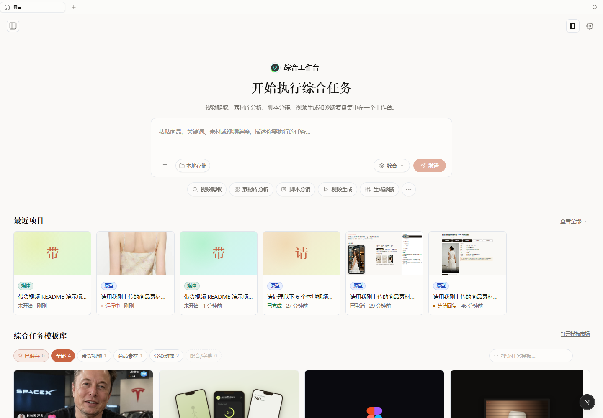
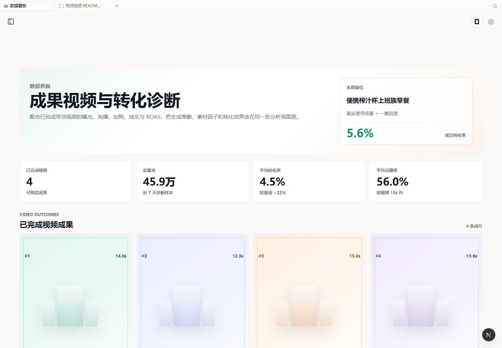

测试

设置密钥

从设置进入，可以录入媒体生成API和媒体理解api,还有其他功能

1. 综合工作台：统一入口

**使用路径：** 启动本地服务后打开 `http://127.0.0.1:17573`。  
**功能说明：** 首页把视频抓取、素材库分析、脚本分镜、视频生成和生成诊断集中到一个工作台。评委可以从最近项目进入已创建的带货视频项目，也可以直接在输入框里输入商品、关键词、素材或公开视频链接，让 Agent 按任务类型进入对应流程。

**拖入白色裙子商品**

**prompt ：这是我要展示的veromoda白色连衣裙，2026夏季新款纯棉，开始进行ai带货视频生成。**

然后ai进行解析，进行剧本生成工作：

进行基础分镜展示，用户可以进行调整，后点击生成分镜脚本，prompt自动填入对话框

2. 素材库工作台：入库、理解、切片、召回

**使用路径：** 左侧导航点击“素材库”，或访问 `/asset-library`。  
**功能说明：** 素材库围绕“爆款参考视频 + 优质公开视频报告”组织资产，提供入库、理解、切片、召回四步链路。页面上方展示带货视频、优质视频、已结构化视频、向量可召回数量；下方可导入本地视频、公开视频链接或批量处理素材。后端会沉淀视频摘要、Hook、节奏、切片特征和 Embedding，为脚本生成和分镜创作提供可召回上下文。 优质视频库可以根据好的反馈数据添加，或者手工添加。

可以上传本地视频：抖音1.mp4

可以输入链接：

抖音分享链接：6.94 复制打开抖音，看看【微微爆爆爆的作品】# 初春穿搭 # 显瘦 # 158小个子穿搭 # ... https://v.douyin.com/f_W144684oY/ C@U.LW YMW:/ :5pm 09/11 

3. 分镜剪辑：脚本、镜头、成片任务分阶段推进

**使用路径：** 打开任意项目 Studio，点击标签栏 `+`，选择“分镜剪辑”；也可通过项目深链进入 `storyboard:editor` 标签。  点击生成分镜提示词就可以，将生成的prompt自动输入对话框。
**功能说明：** 分镜工作台把带货视频创作拆成六个阶段：商品素材、剧本生成、基础分镜、一键成片、任务进度、预览导出。中间区域编辑脚本标题、复用模板、卖点、CTA 和镜头列表；每个镜头可独立调整画面目标、时长、素材切片和台词。右侧阶段栏显示当前进度，并把“一键成片”和“任务进度”拆开，避免模型长任务阻塞 UI 或 Agent 越权直接跑完整链路。

### 4. 数据看板：生成因子与转化诊断

**使用路径：** 左侧导航点击“数据看板”，或访问 `/video-dashboard`。  
**功能说明：** 数据看板展示已完成视频、曝光、平均转化率、完播率、ROAS 和最佳视频。下方以视频卡片、生成因子热力图、因子命中分布和下一轮建议，把脚本策略、素材因子和转化结果放在同一张分析视图里。当前为可解释样例数据，展示后续接入真实投放数据后的增长复盘形态。

也可以一键自动生成

