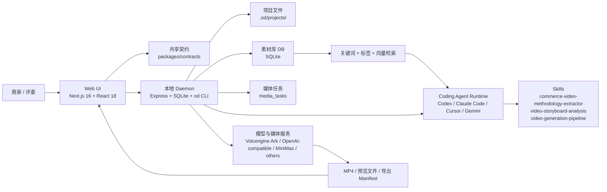
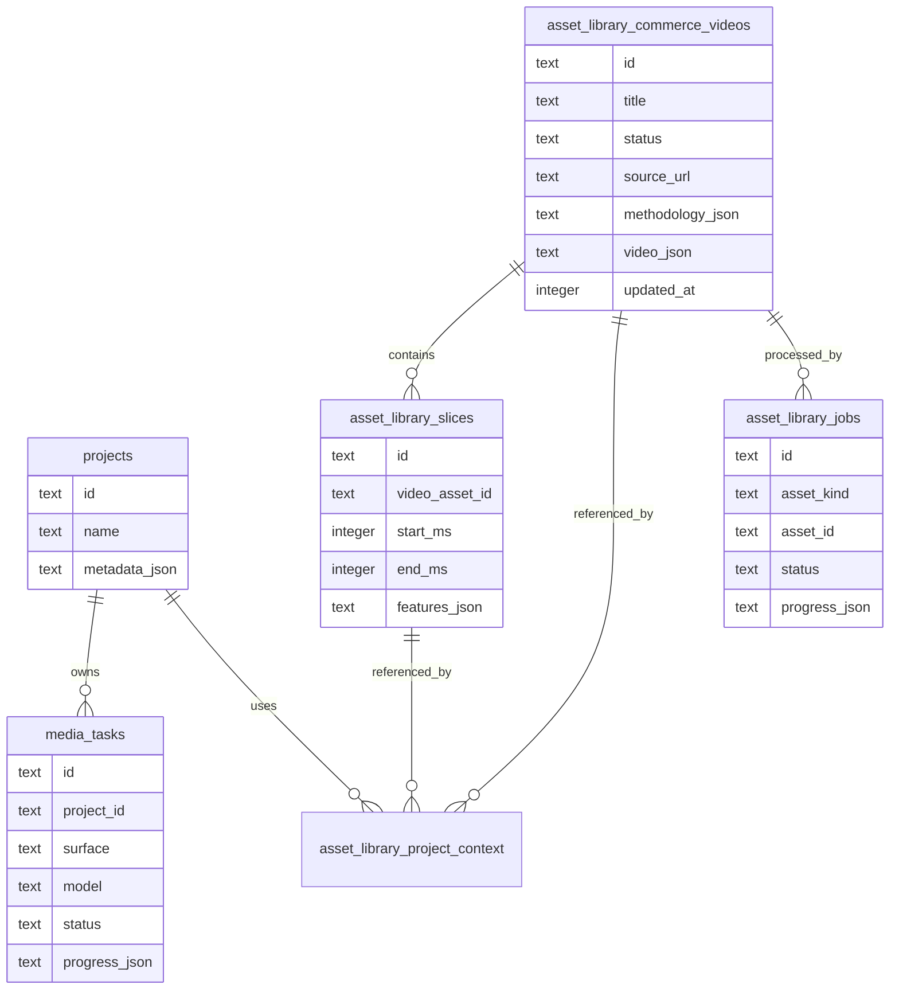
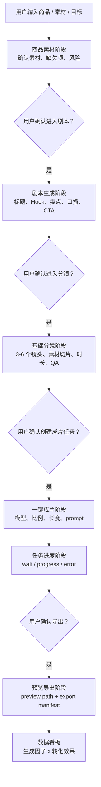

# 电商场景 AIGC 带货视频生成系统 - 完赛项目提报材料

> 用途：统一飞书文档 / 项目提交页 / 答辩复评材料。  
> 状态：可直接粘贴到飞书；带 `待补充` 的字段需要团队在最终提交前补齐。  
> 安全提醒：评审材料、公开仓库、README、演示视频中不要出现任何模型 API Key、Endpoint 私密配置、账号密码或内部额度信息。

## 1. 基础信息

| 字段               | 内容                                                         |
| ------------------ | ------------------------------------------------------------ |
| 提效形式           | 统一飞书文档                                                 |
| 项目名称           | 电商场景 AIGC 带货视频生成系统                               |
| 参赛课题           | 电商场景 AIGC 带货视频生成系统                               |
| 项目简称           | Commerce Video Workbench / 带货视频工作台                    |
| 团队名称           | 睡了么队                                                     |
| 一句话核心业务价值 | 让商家从商品素材出发，端到端生成 15 秒内的带货短视频，并通过分镜干预、素材检索和转化看板，把一次性 AIGC 出片升级为可复盘、可迭代的增长生产线。 |
| 当前完成度         | 可用本地 Demo + 可复核源码分支；P0 工作流闭环已实现，P1/P2 能力覆盖素材检索、分镜编辑、任务进度、方法论提炼和数据看板。实际云端成片依赖模型密钥与额度配置。 |
|                    |                                                              |
| 提交分支           | `codex/ecommerce-video-workbench`                            |
|                    |                                                              |
|                    |                                                              |
|                    |                                                              |
|                    |                                                              |
|                    |                                                              |
|                    |                                                              |

## 2. 团队成员与分工

| 成员  | 学校 / 专业 | 角色                        | 分工                                                           |
| --- | ------- | ------------------------- | ------------------------------------------------------------ |
| 谭星语 | 北京邮电大学  | 全栈开发 / AI Agent 编排 / 工程联调 | 产品设计、前端工作台、后端 commerce-video workflow、素材库与生成接口、CLI、测试、提报材料整理 |
| 炊兴迪 | 北京邮电大学  | 数据处理                      | 数据看板、素材标注、测试素材、数据库搭建、答辩材料                                    |

## 3. 项目故事与业务价值

TikTok Shop、抖音电商和跨境电商场景里，短视频已经成为商家获取流量、解释卖点和拉动成交的关键内容形态。中小商家通常缺少专业脚本、拍摄和剪辑团队，单纯用通用文生视频模型又容易出现商品不准、卖点不清、分镜不可控、效果不可复盘的问题。

本项目基于 Open Design 的本地优先、Agent-native 架构，扩展出面向电商带货视频的工作台：商家可以导入商品素材和参考视频，系统将素材结构化为商品、视频、slice 三层资产；Agent 根据素材、爆款方法论和商品卖点生成脚本与分镜；用户在分镜级编辑器中做局部干预；后端通过专用 `commerce-video` 工作流创建成片任务、跟踪进度、预览导出；最终通过数据看板把生成因子和转化结果联系起来，为下一轮视频生产提供依据。

核心价值不是只生成一条视频，而是形成“素材沉淀 -> 方法论提炼 -> 脚本分镜 -> 一键成片 -> 效果复盘”的电商内容生产闭环。

## 4. 核心功能清单

1. 项目商品素材与参考视频入库  
   商品图片保存到项目内 commerce-video 素材阶段；全局素材库只保存参考带货视频、优质公开视频报告和可检索方法论上下文。

2. 多颗粒度结构化素材理解  
   对带货视频进行整体理解、切片、slice 特征抽取和 Embedding 配置，形成商品维度、视频维度、切片维度的可检索资产。

3. 素材检索与爆款方法论提炼  
   支持关键词、标签、向量相似度混合召回；`commerce-video-methodology-extractor` skill 将同结构带货视频沉淀为中文创作方法论和可复用 child skill。

4. 剧本生成与分镜级编辑  
   前端 `StoryboardEditor` 提供脚本模板、卖点编辑、分镜列表、素材切片绑定、时长调整、台词改写、单镜重生成提示词。

5. 严格分阶段一键成片工作流  
   后端和 CLI 将流程拆为：商品素材上传 -> 剧本生成 -> 基础分镜 -> 一键成片 -> 任务进度 -> 预览导出。每个阶段独立保存状态，避免 Agent 一次性越权跑完整链路。

6. 成片预览、导出与转化诊断看板  
   成片任务完成后写入预览路径和导出 manifest；`VideoDashboardView` 汇总曝光、完播、加购、转化、ROAS，并展示生成因子与转化效果的热力图、气泡图和下一轮建议。

## 5. 端到端使用流程

1. 评委打开在线 Demo 或按本文运行说明在本地启动系统，进入 Open Design 首页。
2. 点击左侧导航的“素材库”，上传商品主图、商品视频或导入参考带货视频。
3. 系统将素材写入素材库，后端可进行视频处理、切片、多模态理解和 Embedding；用户也可以通过 `od assets commerce-videos search/import/process/slice/embed` 走 CLI 路径。
4. 用户进入项目 Studio，点击标签栏的 `+`，选择“分镜剪辑”，打开带货视频分镜工作台。
5. 在“商品素材”阶段确认素材；进入“剧本生成”阶段，选择脚本模板或让 Agent 根据商品卖点、参考视频方法论生成标题、Hook、口播和 CTA。
6. 在“基础分镜”阶段编辑每个镜头的画面目标、素材切片、时长、台词和质量检查点；必要时对单个镜头生成局部重渲染提示词。
7. 在“一键成片”阶段选择视频模型、比例和 15 秒以内时长，后端创建媒体生成任务；“任务进度”阶段单独等待并展示进度、失败原因和重试信息。
8. 任务完成后进入“预览导出”，获取视频预览路径和导出 manifest；随后在“数据看板”查看已完成视频、转化指标和下一轮生成建议。

## 6. 系统架构图



## 7. 核心技术栈

| 层级            | 技术栈                                                                                                                      | 说明                                                                    |
| ------------- | ------------------------------------------------------------------------------------------------------------------------ | --------------------------------------------------------------------- |
| 前端            | Next.js 16、React 18、TypeScript、CSS Modules / scoped CSS、`@open-design/components`                                        | 首页导航、素材库、分镜编辑器、数据看板、项目 Studio                                         |
| 后端            | Node.js 24、Express、TypeScript、Server-Sent Events / HTTP API                                                              | 本地 daemon、项目管理、素材库、媒体任务、Agent 调度                                      |
| CLI           | `od` CLI                                                                                                                 | `od assets ...` 与 `od commerce-video ...` 让能力同时可被 Web UI 和外部 Agent 调用 |
| 数据库           | SQLite / `better-sqlite3`                                                                                                | 项目、素材库、视频 slice、处理任务、媒体任务持久化                                          |
| AI / 媒体       | Volcengine Ark Seedance / Seedream / Doubao TTS、Volcengine Ark video understanding、OpenAI-compatible provider、MiniMax 可选 | 视频生成、视频理解、图片生成、TTS、Embedding / 多模态能力                                  |
| Agent / Skill | Codex、Claude Code、Cursor Agent、Gemini CLI 等；`SKILL.md` 文件协议                                                              | Agent 读取素材库上下文、方法论 skill、脚本与分镜约束，生成可执行提示词                             |
| 部署            | 本地 `pnpm tools-dev`；可选 Docker / packaged app                                                                             | 当前评审优先提供本地可复核 Demo；线上地址待补充                                            |

## 8. README / 本地运行说明

### 环境要求

- Node.js `~24`
- pnpm `10.33.2`
- 推荐 macOS、Linux、WSL2；Windows native 为 best-effort
- 可选：Codex / Claude Code / Cursor Agent / Gemini CLI 等本地 Agent CLI
- 可选：在 Settings -> Media providers 或环境变量中配置模型密钥；不要提交密钥

### 启动步骤

```bash
pnpm install
pnpm tools-dev run web --daemon-port 17456 --web-port 17573
```

启动后访问：

```text
http://127.0.0.1:17573
```

健康检查：

```text
http://127.0.0.1:17456/api/health
```

### 关键目录

| 目录 / 文件                                                | 用途                                 |
| ------------------------------------------------------ | ---------------------------------- |
| `apps/web/src/components/StoryboardEditor.tsx`         | 带货视频脚本、分镜、生成、进度、导出工作台              |
| `apps/web/src/components/VideoDashboardView.tsx`       | 成果视频与转化诊断看板                        |
| `apps/web/src/providers/commerce-video.ts`             | 前端调用 commerce-video API 的 provider |
| `apps/daemon/src/routes/commerce-video.ts`             | 后端 commerce-video workflow API     |
| `apps/daemon/src/commerce-video-cli.ts`                | `od commerce-video ...` CLI        |
| `apps/daemon/src/routes/asset-library.ts`              | 带货视频、质量视频、Embedding、处理任务等素材库 API   |
| `apps/daemon/src/asset-library-search.ts`              | 关键词、标签、向量相似度混合检索                   |
| `packages/contracts/src/api/commerce-video.ts`         | Web / daemon / CLI 共享 DTO          |
| `skills/commerce-video-methodology-extractor/SKILL.md` | 带货视频方法论提炼 skill 包                  |

### CLI 体验路径

```bash
od commerce-video workflow --project <project-id> --json
od commerce-video materials --project <project-id> --materials-json '{"productMaterialIds":[],"uploadedFiles":[]}' --json
od commerce-video script --project <project-id> --title "便携榨汁杯 15 秒带货脚本" --hook "通勤早餐来不及？" --prompt-file script.txt --json
od commerce-video storyboard --project <project-id> --storyboard-json storyboard.json --json
od commerce-video generate --project <project-id> --model doubao-seedance-2-0-260128 --length-sec 15 --aspect 9:16 --json
od commerce-video jobs --project <project-id> --json
od commerce-video wait <job-id> --json
od commerce-video preview --project <project-id> --json
od commerce-video export --project <project-id> --json
```

素材库示例：

```bash
od assets status --json
od assets commerce-videos search --connector bilibili --query "女装 带货 防晒衣" --limit 20 --sort hot --json
od assets commerce-videos import --title "<title>" --connector bilibili --source-url "<url>" --subject "防晒衣" --category "带货视频样本" --summary "<why selected>" --json
od assets commerce-videos process <asset-id> --wait --json
od assets commerce-videos slice <asset-id> --wait --json
od assets commerce-videos embed <asset-id> --include-slices --wait --json
od assets commerce-videos methodology-summary --query "防晒衣 痛点钩子" --json
```

## 9. API 清单

### Commerce Video Workflow

| 方法     | 路径                                            | 作用                            |
| ------ | --------------------------------------------- | ----------------------------- |
| `GET`  | `/api/projects/:id/commerce-video/workflow`   | 读取或初始化项目级带货视频 workflow        |
| `POST` | `/api/projects/:id/commerce-video/materials`  | 保存商品素材、参考视频、上传文件等素材阶段状态       |
| `POST` | `/api/projects/:id/commerce-video/script`     | 保存剧本标题、Hook、口播、卖点、CTA         |
| `POST` | `/api/projects/:id/commerce-video/storyboard` | 保存 3-6 个分镜镜头、时长、画面目标、素材需求     |
| `POST` | `/api/projects/:id/commerce-video/generate`   | 创建视频生成任务，写入模型、比例、时长、生成 prompt |
| `GET`  | `/api/projects/:id/commerce-video/jobs`       | 查看项目下 commerce-video 生成任务     |
| `POST` | `/api/commerce-video/jobs/:jobId/wait`        | 长轮询等待任务进度或终态                  |
| `GET`  | `/api/projects/:id/commerce-video/preview`    | 读取预览路径和导出状态                   |
| `POST` | `/api/projects/:id/commerce-video/export`     | 写入导出 manifest，标记最终可下载路径       |

### 素材库与检索

| 能力     | 说明                                                 |
| ------ | -------------------------------------------------- |
| 项目商品素材 | 商品图进入项目内 commerce-video 素材阶段，不写入全局参考素材库            |
| 带货视频库  | 保存公开视频搜索结果、来源、摘要、方法论标签、切片、Embedding                |
| 质量视频库  | 可复用相同数据结构沉淀优质样本                                    |
| 混合检索   | 关键词 + 标签 + 向量相似度综合排序                               |
| 批处理任务  | 下载、probe、slice、多模态理解、Embedding、methodology summary |

## 10. 数据结构 / ER 图



项目级 workflow 以文件形式保存：

```text
.od/projects/<project-id>/commerce-video.workflow.json
```

该文件记录六阶段状态、素材、剧本、分镜、生成任务、导出 manifest，便于评审复核和本地调试。

## 11. 大模型 / AI 能力使用说明

| AI 能力            | 在系统中的位置     | 实现说明                                                                                         |
| ---------------- | ----------- | -------------------------------------------------------------------------------------------- |
| 视频生成             | 一键成片阶段      | `commerce-video generate` 调用 media dispatcher，支持 Volcengine Ark Seedance 系列等视频模型，默认限制 15 秒以内 |
| 视频理解             | 素材处理阶段      | Volcengine Ark video understanding 可将参考视频拆成整体摘要、Hook、CTA、节奏、风格、slice 特征                      |
| Embedding / 向量检索 | 素材库检索阶段     | 素材、视频、slice 的 `embedding_text` 进入向量化流程，检索时与关键词和标签共同排序                                        |
| Agent 编排         | 脚本、分镜、方法论提炼 | Agent 通过 system prompt 和 `SKILL.md` 约束按阶段工作，不允许绕过 dedicated workflow                         |
| Prompt 策略        | 每个阶段独立提示词   | 商品素材、剧本生成、基础分镜、一键成片、任务进度、预览导出分别有系统提示词，阶段完成后必须等待用户确认                                          |
| TTS / BGM / 字幕   | 创作链路预留      | 前端导出配置包含字幕、口播、BGM 开关；后端 media provider 已支持 TTS provider，适合下一步联调                              |

## 12. Prompt / Agent 流程图



关键设计：Agent 不直接调用通用 `media generate` 完成带货视频，而必须走 `commerce-video` 专用 API / CLI，这保证了 Web UI、CLI、workflow 文件、任务进度和导出状态保持同步。

## 13.使用流程

1.综合工作台：统一入口


**使用路径：** 启动本地服务后打开 `http://127.0.0.1:17573`。  
**功能说明：** 首页把视频抓取、素材库分析、脚本分镜、视频生成和生成诊断集中到一个工作台。评委可以从最近项目进入已创建的带货视频项目，也可以直接在输入框里输入商品、关键词、素材或公开视频链接，让 Agent 按任务类型进入对应流程。

引导用户进入ai剪辑视频确认：上传素材会经过ai解析，理解，然后由ai进行商品相关问题的提问


然后ai进行解析，进行剧本生成工作：


进行基础分镜展示，用户可以进行调整，后点击生成分镜脚本，prompt自动填入对话框


## 14. 关键工程难点与解决方案

| 难点                     | 风险                                                 | 解决方案                                                                                                              |
| ---------------------- | -------------------------------------------------- | ----------------------------------------------------------------------------------------------------------------- |
| 长耗时视频生成任务容易阻塞 UI       | 用户不知道任务是否还在运行，失败后难以复现                              | 后端创建 `media_tasks`，`generate` 只负责创建任务，`wait` 单独长轮询进度；前端把“一键成片”和“任务进度”拆为两个阶段                                       |
| Agent 可能一次性越过用户确认跑完整链路 | 成本不可控，阶段状态和 UI 不一致                                 | system prompt 明确“严格分阶段执行”，并提供 `commerce-video materials/script/storyboard/generate/jobs/wait/preview/export` 专用命令 |
| 素材库数据重、视频文件大           | 列表加载慢，前端可能误预加载大量视频                                 | 列表接口返回轻量 DTO，重字段在详情、下载或显式展开时读取；前端列表不为每行挂载真实视频 `src`                                                               |
| 商品素材和参考视频需要可复用         | 只生成一次视频会丢失方法论和素材价值                                 | 设计商品、commerce video、slice、methodology、embedding、project context 多层数据结构                                            |
| 模型 provider 差异大        | Seedance、MiniMax、OpenAI-compatible 等接口形态、轮询、输入限制不同 | 后端 media dispatcher 统一封装生成、轮询、下载、错误反馈；commerce-video 工作流只依赖统一 `generateMedia`                                     |
| 前后端契约容易漂移              | UI、daemon、CLI 字段不一致会导致评审路径断裂                       | `packages/contracts/src/api/commerce-video.ts` 定义共享 DTO，web provider、daemon route、CLI 共用同一业务形状                    |

## 15. 部署与访问说明

### 推荐评审路径

1. 优先打开在线 Demo 链接：待补充。
2. 若线上 Demo 无法访问，使用演示视频：待补充。
3. 若需要复核代码和本地运行，使用仓库分支 `codex/ecommerce-video-workbench`，按第 8 节启动。

### 本地端口

| 服务         | 地址                       |
| ---------- | ------------------------ |
| Web        | `http://127.0.0.1:17573` |
| Daemon API | `http://127.0.0.1:17456` |

### 模型配置

在 Settings -> Media providers 中配置 Volcengine / OpenAI-compatible / MiniMax 等 provider，或通过环境变量提供。评审材料中只说明配置方式，不提供真实密钥。

## 16. 项目亮点 / 创新点

1. 从“生成视频”升级为“电商视频生产流水线”  
   覆盖素材、方法论、脚本、分镜、成片、进度、导出和转化复盘，而不是单点调用文生视频模型。

2. Web UI 与 `od` CLI 双入口同构  
   评委可以通过前端交互体验，也可以用 CLI 复核每个阶段；外部 Agent 能直接调用同一套 `/api/*` 能力。

3. 爆款视频 DNA 可沉淀为 Skill  
   `commerce-video-methodology-extractor` 将参考视频聚类为中文方法论 skill，让后续商品复用“创作机制”，而不是复制原视频。

## 17. 测试与可复核材料

已覆盖的关键测试文件：

| 测试文件                                                         | 覆盖内容                                      |
| ------------------------------------------------------------ | ----------------------------------------- |
| `packages/contracts/tests/commerce-video.test.ts`            | workflow 文件名、六阶段顺序、完整 15 秒带货视频 DTO        |
| `apps/daemon/tests/commerce-video-workflow-routes.test.ts`   | 后端 workflow 初始化、脚本/分镜保存、生成沙箱门禁、任务等待、预览导出  |
| `apps/daemon/tests/commerce-video-cli.test.ts`               | CLI JSON 输出、`--prompt-file` / stdin 兼容    |
| `apps/web/tests/components/StoryboardEditor.test.tsx`        | 分镜编辑器加载、阶段右侧栏、阶段确认门、单镜重生成、脚本模板、生成/进度/导出拆分 |
| `apps/web/tests/components/AssetLibraryView.test.tsx`        | 素材库上传模块、重复标签渲染、StrictMode 去重、不预加载源视频      |
| `apps/daemon/tests/asset-library-search.test.ts`             | 素材库关键词、标签、向量召回排序                          |
| `apps/daemon/tests/asset-library-methodology-prompt.test.ts` | 方法论 summary prompt 生成                     |

建议提交前运行：

```bash
pnpm guard
pnpm typecheck
pnpm --filter @open-design/web test
pnpm --filter @open-design/daemon test
pnpm --filter @open-design/contracts test
```

如果时间有限，至少运行：

```bash
pnpm guard
pnpm typecheck
pnpm --filter @open-design/web test -- StoryboardEditor
pnpm --filter @open-design/daemon test -- commerce-video
```

## 18. 商业化 / 场景落地设想

目标客户是跨境电商中小商家、内容代运营团队、MCN / 达人短视频团队和品牌私域运营团队。落地路径可以分三步：

1. MVP：商品素材 + 剧本分镜 + 单条视频生成，帮助商家降低第一条带货视频制作门槛。
2. 增长工具：接入投放 / 店铺数据，用生成因子解释 CTR、完播、加购和转化差异。
3. 规模化生产：按品类沉淀视频方法论 skill，批量生成多版本脚本 / 分镜 / 成片，用 A/B 数据自动选择下一轮策略。

## 
